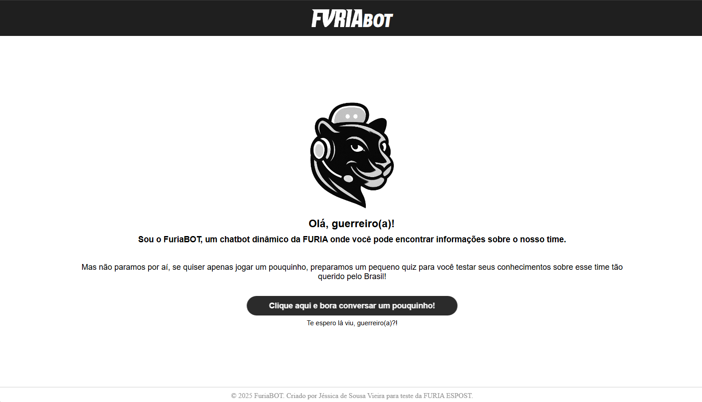
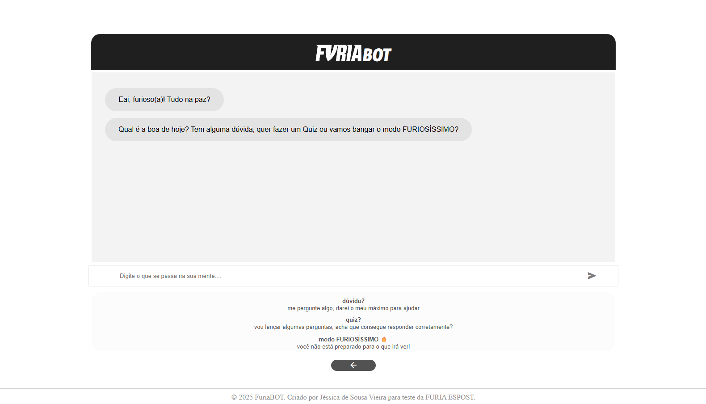
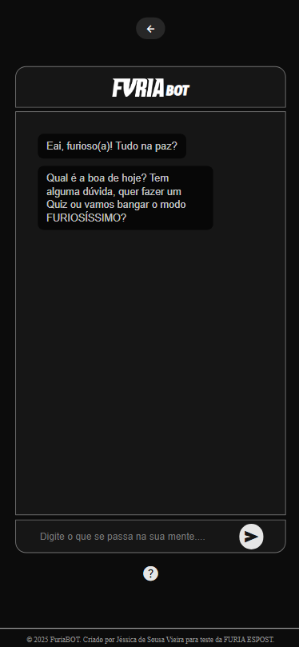

# FuriaBOT

[](https://github.com/jessicasousav/Furiabot-web/blob/main/LICENSE)

FuriaBOT é um chatbot interativo criado para um teste técnico e destinado aos fãs da equipe de CS da **FURIA Esports**. Com uma interface moderna e inspirada na identidade visual da FURIA, o bot proporciona interações divertidas, quiz temático e informações sobre o time e a marca.



## Tecnologias

- React.js
- HTML5 + CSS3
- Javascript

## Funcionalidades

- Interface responsiva
- Identidade visual inspirada na FURIA
- Conversação amigável com o usuário
- Quiz sobre o time
- Informatições sobre a FURIA
- Design claro e objetivo

### O que perguntar ao FuriaBOT
Com o sistema de ativação por palavras-chave, o usuário pode escrever frases completas ou apenas palavras específicas para receber respostas do bot.

**Palavras de ativação:**
- **oi, tudo bem, olá:** Retorna uma saudação ao usuário.
- **paz, estou bem:** Retorna uma resposta à saudação do usuário.
- **jogo, quando, dropa:**
Retorna um link com informações sobre jogos da Furia.
- **notícia, informa...:** Retorna um link com notícias atualizadas sobre a Furia.
- **dúvida, pergunta, sim:** Retorna sugestões de perguntas ao bot.
- **roupa, vest..., camis..., moda, merchandise:** Retorna um link para a loja oficial.
- **arm...:** Retorna as armas populares pelos jogadores no CS.
- **contato, whats, wpp, furia:** Retorna o link para o WhatsApp oficial da Furia.
- **quiz:** Dá inicio ao quiz com 3 perguntas aleatórias sobre a Furia.
- **não, obrigado, valeu, ok, parar, nada, tchau:** Retorna uma despedida ao usuário.
- **furios...**: Ativa o *Modo Furioso* com estética diferenciada.

**Exemplo:**

<kbd>**Usuário: Oi, chat!** </kbd>

<kbd> *FuriaBOT: saudação* </kbd>

<kbd> **Usuário: Vamos fazer o quiz!** </kbd>

<kbd> *FuriaBOT: chamada e inicio do quiz* </kbd>

## Design

O design do FuriaBOT foi desenvolvido com base nas cores da identidade visual da FURIA Esports. Com sua paleta monocromática, o visual mantém a personalidade da marca sem perder legibilidade ou impacto visual.

### Responsividade
Pensando no conforto do usuário, o FuriaBOT possui dois layouts: um para dispositivos móveis e outro para telas maiores como tablets e desktops. A versão desktop é mais clean, enquanto a versão mobile possui um visual dark.

<p align="center">
<kbd></kbd><kbd></kbd>
</p>

### Modo Furioso
Quando o usuário envia algo contendo a palavra **"furioso"**, o sistema ativa o *Modo Furioso*, alterando a estética da interface e criando uma experiência visual divertida e elegante. **Vale a pena testar!**

## Como rodar localmente

1. Clone o repositorio:

    ```bash
    git clone https://github.com/jessicasousav/furiabot-web
    ```

2. Entre na pasta clonada
    
    ```bash
    cd furiabot-web
    ```

3. Inicie o projeto

    ```bash
    npm start
    ```

## Como acessar o deploy
Acesse o projeto em:
https://jessicasousav.github.io/furiabot-web

## Autor

Projeto desenvolvido por [Jéssica de Sousa Vieira](http://linkedin.com/in/jessica-sousa-vieira) com fins educacionais e para teste de habilidades. Não afiliado oficialmente à FURIA Esports. 